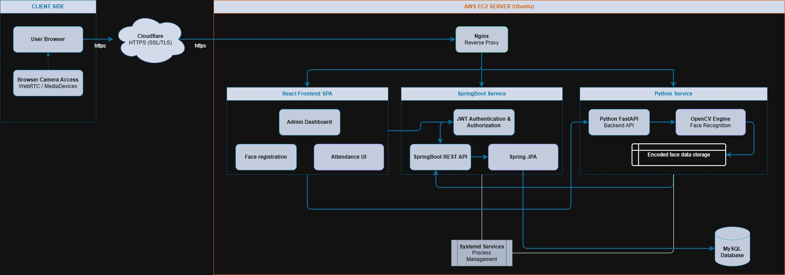
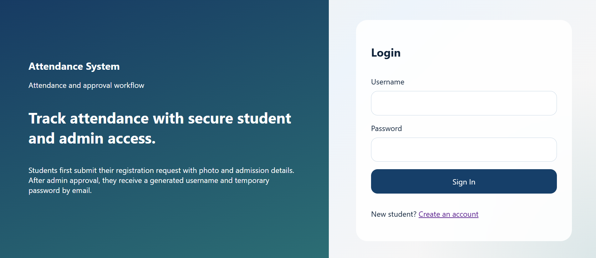
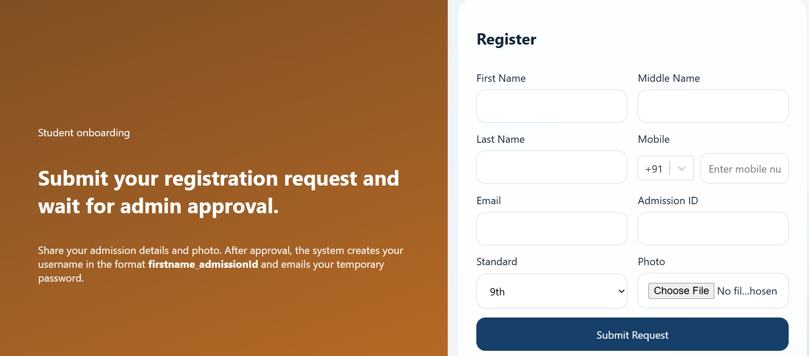
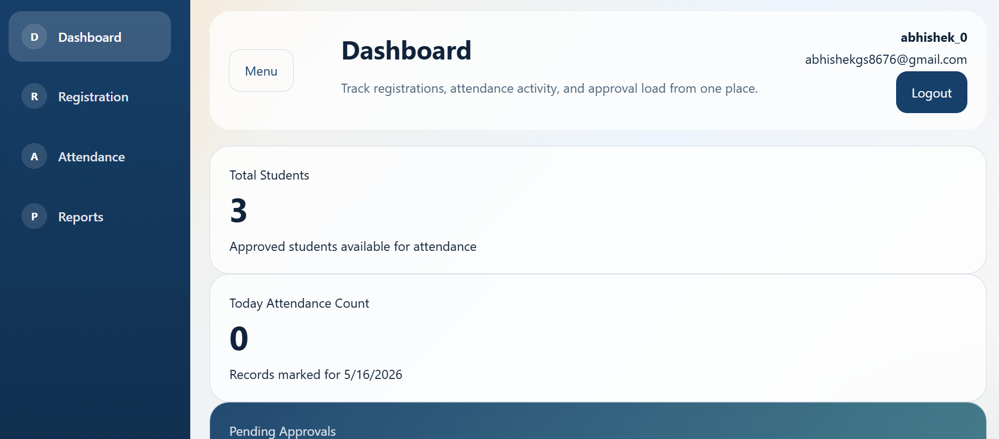
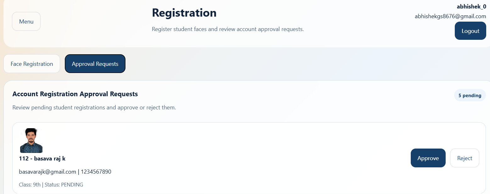
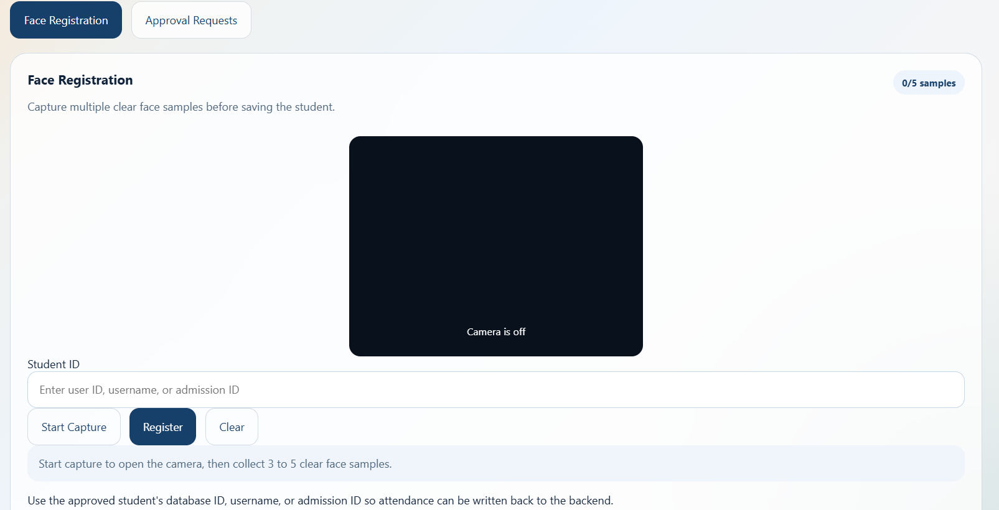
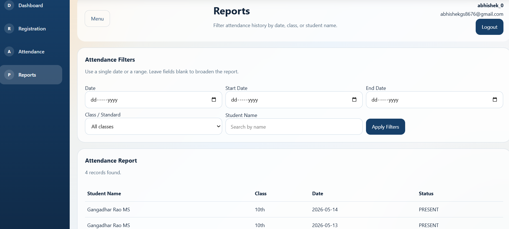
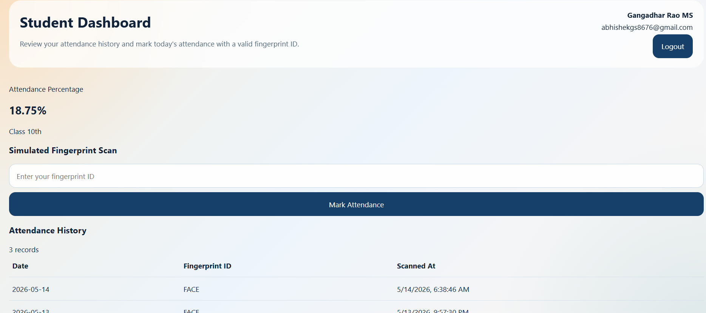
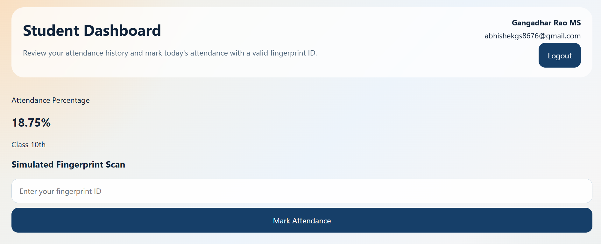

# Tuition Attendance System

A production-oriented attendance platform for tuition centers, designed for class 9th and 10th operations. The repository combines a secure Spring Boot backend, a React admin/student portal, a Python face-recognition service, and a desktop biometric middleware layer for future device integrations.

## Overview

This system supports:

- student self-registration with admin approval
- admin-managed attendance workflows
- fingerprint-ready and face-recognition-ready attendance flows
- JWT-based authentication and role-based access
- first-login password reset
- attendance reporting and dashboards
- local and deployable multi-service architecture

## Repository Structure

```text
Tution_attendance_system/
├── backend/                 Spring Boot REST API
├── frontend/                React + Vite admin/student web app
├── face_attendance_service/ Python FastAPI + desktop face attendance tools
├── desktopapp/              Java desktop biometric middleware
├── AttendanceSystemPhotos/  Screenshots and architecture assets
└── README.md
```

## Architecture

The following architecture diagram is included in the repository:



Editable source:

- `AttendanceSystemPhotos/AttendanceSystem.drawio`

## Core Modules

### 1. Backend

Location: `backend/`

Stack:

- Java 17
- Spring Boot 3
- Spring Security
- JWT
- Spring Data JPA
- MySQL
- Spring Mail
- Springdoc OpenAPI

Responsibilities:

- authentication and authorization
- pending registration approval flow
- student and admin dashboards
- attendance persistence
- attendance request workflow
- report generation
- file upload handling
- email notification flow

### 2. Frontend

Location: `frontend/`

Stack:

- React
- Vite
- React Router
- Axios
- Tailwind CSS v4

Responsibilities:

- login and password change flow
- student registration request form
- admin dashboard
- face registration UI
- attendance monitoring UI
- approval queue
- attendance reporting screens

### 3. Face Attendance Service

Location: `face_attendance_service/`

Stack:

- Python
- FastAPI
- OpenCV
- `face_recognition`
- Tkinter desktop UI

Responsibilities:

- face encoding registration
- browser-based face attendance capture
- desktop face attendance workflow
- backend attendance callback integration

### 4. Desktop Biometric Middleware

Location: `desktopapp/`

Stack:

- Java
- Spring Boot
- JavaFX/Desktop integration path
- biometric device abstraction

Responsibilities:

- biometric middleware orchestration
- local capture logic
- future fingerprint SDK integration
- offline-first attendance sync support

## Key Functional Flows

### Student Registration Flow

1. Student submits registration request with personal details and photo.
2. Request is stored as pending.
3. Admin reviews and approves or rejects the request.
4. On approval, the system creates the user account.
5. Credentials are sent to the student by email.
6. Student logs in and must change the temporary password on first login.

### Attendance Flow

Supported attendance modes in this repository:

- fingerprint-ready attendance flow
- face-recognition attendance flow
- browser-assisted face capture
- desktop-assisted face capture

Rules enforced:

- one attendance record per student per day
- secure server-side attendance storage
- admin reporting and audit visibility

## Features

- role-based access for admin and students
- registration request approval workflow
- first-login password change
- admin dashboard with summary cards
- face registration from the web UI
- attendance scanning page with live camera integration
- pending approval management
- attendance reports with filters
- student dashboard with attendance history
- Swagger/OpenAPI support
- profile-based environment setup for `dev`, `qa`, `staging`, and `prod`

## Screenshots

### Login



### Student Registration



### Admin Dashboard



### Approval Requests



### Face Registration



### Attendance


### Reports



### Student Dashboard





## Getting Started

## Backend Setup

```bash
cd backend
mvn spring-boot:run -Dspring-boot.run.profiles=dev
```

Typical local backend URL:

- `http://localhost:8085`

Swagger UI:

- `http://localhost:8085/swagger-ui/index.html`

## Frontend Setup

```bash
cd frontend
npm install
npm run dev
```

Typical local frontend URL:

- `http://localhost:5173`

## Face Attendance Service Setup

```bash
cd face_attendance_service
python -m venv .venv
.venv\Scripts\activate
pip install -r requirements.txt
python -m uvicorn app.main:app --reload --host 0.0.0.0 --port 8095
```

## Desktop Middleware Setup

```bash
cd desktopapp
mvn spring-boot:run
```

## Environment Profiles

All major applications in this repository are profile-aware.

Supported profiles:

- `dev`
- `qa`
- `staging`
- `prod`

Examples:

### Backend

```bash
mvn spring-boot:run -Dspring-boot.run.profiles=prod
```

### Frontend

```bash
npm run dev:prod
```

### Face Attendance Service

```powershell
$env:FACE_APP_PROFILE="prod"
python -m uvicorn app.main:app --reload --host 0.0.0.0 --port 8095
```

## Deployment Notes

This project has been structured to support deployment behind Nginx and EC2-style Linux hosts.

Typical deployment model:

- frontend served as static Vite build
- backend served as Spring Boot jar
- face service served via Uvicorn
- reverse proxy routing through Nginx

Recommended production practices:

- store secrets in environment variables
- do not hardcode SMTP or DB credentials
- use HTTPS in front of Nginx
- restrict camera and attendance endpoints appropriately
- configure uploads and logs on persistent storage

## Security Highlights

- BCrypt password hashing
- JWT-based authenticated API access
- role-based endpoint protection
- pending approval before student activation
- forced password reset for first login
- no raw biometric image storage in the fingerprint flow

## API Scope

Primary API areas available in the backend:

- `/api/auth/*`
- `/api/student/*`
- `/api/admin/dashboard/*`
- `/api/admin/registration/*`
- `/api/admin/attendance/*`

For the latest service-specific details, see:

- `backend/`
- `face_attendance_service/README.md`

## Demo Assets

Screenshots and architecture files used in this README are stored in:

- `AttendanceSystemPhotos/`

## Roadmap Ideas

- CSV/PDF export
- real fingerprint SDK integration
- attendance notifications
- audit logs
- automated test coverage expansion
- cloud storage migration for uploaded media

## License / Usage

This repository is currently documented as a project codebase without a dedicated open-source license file. Add a license if you intend to distribute or publish it publicly.
